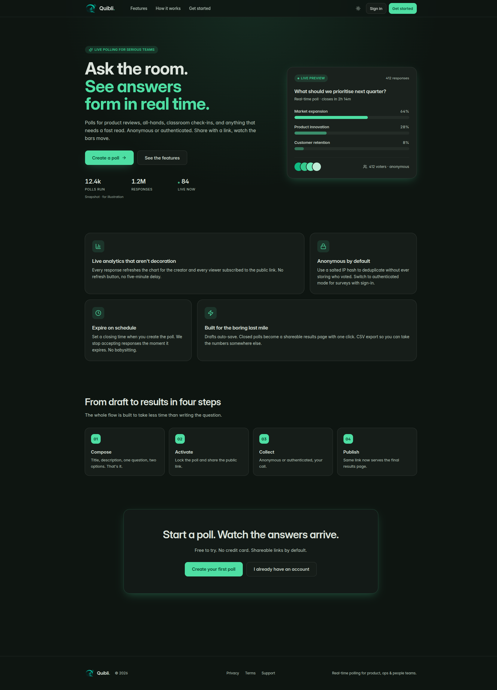
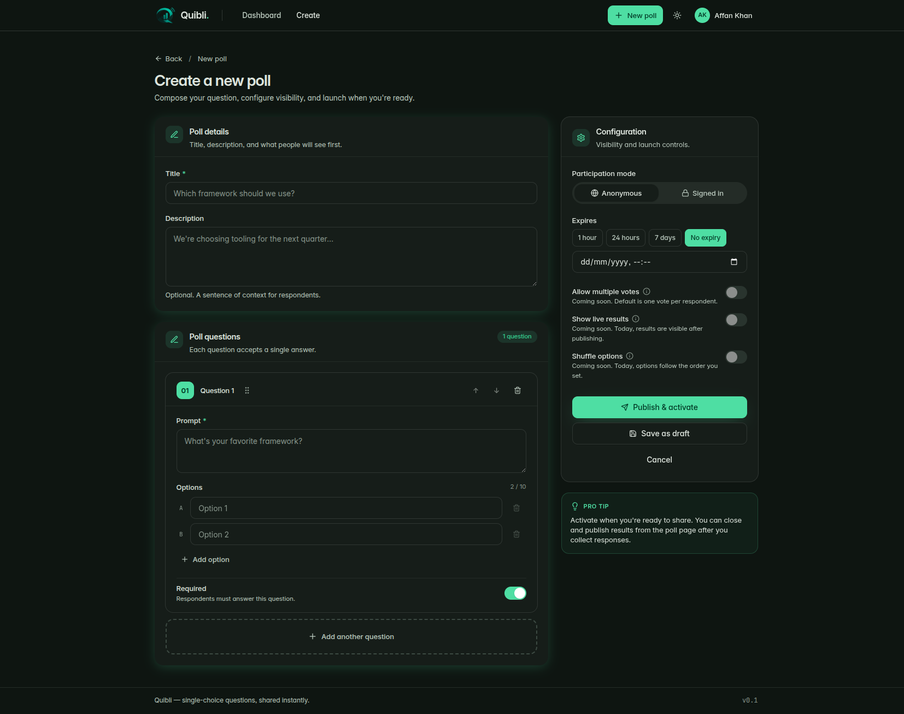
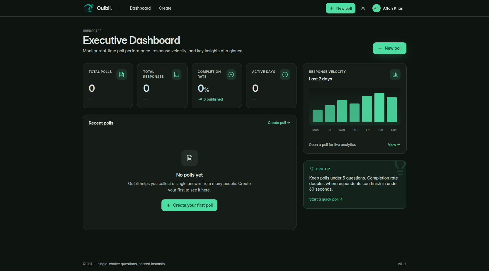
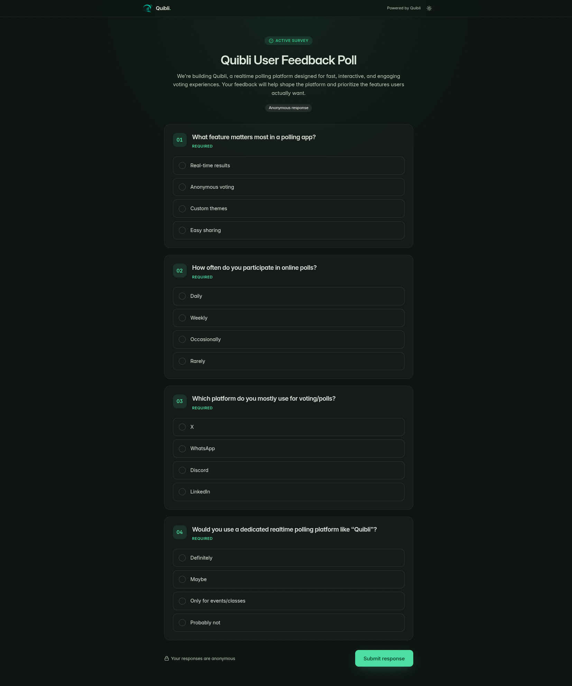

<div align="center">


# Quibli

**Create single-choice polls, share them through a public link, and watch responses & analytics update live.**

[](https://quibli-sepia.vercel.app)
[](https://quibli.onrender.com/health)
[](#tech-stack)
[](#tech-stack)
[](#realtime)

[Live Demo](https://quibli-sepia.vercel.app) · [Report an issue](https://github.com/mohdaffankhan/quibli/issues)

</div>



---

Quibli is a full-stack feedback platform. A signed-in creator builds a poll of
single-choice questions, marks each as mandatory or optional, chooses anonymous
or authenticated responses, and sets an expiry. The poll is shared as a public
link; once it's complete the creator publishes the results back to that **same
link**. Response counts and analytics stream to the creator in real time over
Socket.io.

> **Single repository.** Backend (`backend/`) and frontend (`frontend/`) live
> together in this one repo, as required for submission.

## Requirement coverage

Every rule from the brief, and where it lives in the code:

| Requirement | Status | Implementation |
|---|---|---|
| Single-option questions | ✅ | One option per question per respondent; enforced in the response service |
| Mandatory / optional questions | ✅ | `isRequired` per question, validated on **both** the React form and the backend |
| Anonymous **and** authenticated modes | ✅ | `responseMode` per poll; authenticated polls require sign-in and enforce one response per user |
| Per-link expiry | ✅ | Every poll has an expiry; checked server-side on **every** read/write — late responses rejected |
| Analytics dashboard | ✅ | Total responses, question-wise summaries, per-option counts & %, velocity timeseries, participation insights, CSV export |
| Publish final results publicly | ✅ | `published` state exposes `/p/:slug/results` to anyone with the link |
| Real-time updates (Socket.io) | ✅ | Live response counts, analytics deltas, and poll-status changes pushed over Socket.io |
| Auth + protected routes | ✅ | Email/password (bcrypt) **and** Sentinel OIDC (PKCE); JWT + rotating refresh tokens in HTTP-only cookies; guarded API + SPA routes |
| Frontend **and** backend | ✅ | Full React SPA + Express API in one repo |
| Public repo + deployed link + README | ✅ | This repo, the live demo above, and this document |

## Screenshots

| Create & configure a poll | Creator dashboard & analytics |
|---|---|
|  |  |

| Public poll / respond view | Landing |
|---|---|
|  |  |

## Features

- **Poll lifecycle** — `draft → active → closed → published`, enforced as a
  state machine in the service layer.
- **Single-option questions** with per-question `isRequired`, validated on the
  client form and re-validated server-side (required questions can't be skipped
  via a crafted request).
- **Anonymous or authenticated** responses per poll; authenticated polls block
  duplicate submissions per user, anonymous polls de-dupe on a salted IP hash.
- **Per-link expiry** — once a poll's expiry passes it is inactive and every
  read/write rejects new responses regardless of the client.
- **Analytics** — totals, question/option breakdowns with percentages, a
  response-velocity timeseries, participation insights, and CSV export.
- **Publish results** — after completion the creator publishes; the same public
  link then renders the final outcome to anyone.
- <a id="realtime"></a>**Realtime (Socket.io)** — rooms `poll:<id>` (public
  totals + status) and `poll-admin:<id>` (creator-only per-option deltas),
  authenticated via the handshake cookie. The frontend merges deltas straight
  into the query cache so the dashboard moves on the socket hop, no refetch.
- **Authentication** — email/password (bcrypt) plus **Sentinel OIDC**
  (Authorization Code + PKCE). Short-lived JWT access tokens with DB-backed
  rotating refresh tokens, all in HTTP-only cookies. Protected API + SPA routes.

## Tech stack

- **Backend:** Express 5 + TypeScript, Drizzle ORM,
  PostgreSQL (Supabase), Socket.io, Zod validation, Helmet.
- **Frontend:** Vite + React 19 + TypeScript, Tailwind CSS v4, React Router 7,
  TanStack Query 5, framer-motion, sonner.

> **Note on the MERN requirement.** The brief asks for MERN. Quibli
> deliberately uses **PostgreSQL + Drizzle ORM** instead of MongoDB: polls,
> questions, options and responses are inherently relational, and the analytics
> aggregation is far cleaner and more correct with SQL `GROUP BY` and
> transactions. Everything else (Express, React, Node) matches MERN. The
> trade-off is intentional and documented.

## Project structure

```
backend/
  src/
    modules/{auth,polls}/        # feature slices (routes → service → db)
    shared/{auth,config,db,errors,middleware,realtime,types,utils}/
  supabase/migrations/           # Drizzle-generated SQL migrations
  tests/                         # vitest integration suite
frontend/
  src/
    components/{ui,polls,public,shell,feedback}/
    pages/                       # Landing, Login, Register, Dashboard,
                                 # PollEditor, PollDetail, PollAnalytics,
                                 # PublicRespond, PublicResults
    hooks/usePollLive.ts         # joins poll / poll-admin rooms → query cache
    lib/{api,auth-context,theme-context,socket,types,utils}
```

## Getting started

### Prerequisites

- Node.js ≥ 20
- pnpm ≥ 10
- A PostgreSQL database (a Supabase project works out of the box)

### 1. Backend

```bash
cd backend
cp .env.example .env          # fill in the values below
pnpm install
pnpm drizzle-kit migrate      # apply migrations to your database
pnpm dev                      # http://localhost:8080
```

| Variable        | Purpose                                              |
| --------------- | ---------------------------------------------------- |
| `NODE_ENV`      | `development` locally, `production` when deployed     |
| `DATABASE_URL`  | PostgreSQL connection string                          |
| `JWT_SECRET`    | Signing secret for access tokens (≥ 32 chars)         |
| `COOKIE_SECRET` | Secret for signing auth / OIDC-state cookies          |
| `SENTINEL_*`    | Sentinel OIDC issuer, client id/secret, redirect URI  |
| `CORS_ORIGIN`   | Allowed frontend origin(s), comma-separated, no slash |
| `FRONTEND_URL`  | SPA origin to return to after the OIDC callback       |
| `IP_HASH_SALT`  | Salt for hashing respondent IPs (≥ 16 chars)          |

### 2. Frontend

```bash
cd frontend
pnpm install
pnpm dev                      # http://localhost:5173
```

For local dev the Vite server proxies `/auth`, `/polls`, `/p` and `/socket.io`
to the backend on port 8080 — no extra config needed. For a **split deployment**
(frontend and backend on different origins) set `VITE_API_URL` to the backend
origin so requests, the Socket.io connection, and the Sentinel login link all
target the API host.

### Scripts

- **Backend:** `pnpm dev` · `pnpm build` · `pnpm test` (vitest integration
  suite) · `pnpm drizzle-kit generate|migrate`
- **Frontend:** `pnpm dev` · `pnpm build` · `pnpm preview` · `pnpm lint`

## Deployment

Quibli is deployed as **two services** (the Socket.io backend needs a
persistent server, so it can't run on Vercel's serverless functions):

| Part | Host | URL |
|---|---|---|
| Frontend (Vite static build) | Vercel | https://quibli-sepia.vercel.app |
| Backend (Express + Socket.io) | Render | https://quibli.onrender.com |
| Database | Supabase Postgres | — |

- **Vercel** — Root Directory `frontend`; env `VITE_API_URL` → the backend URL
  (rebuild after changing it; Vite inlines it at build time).
- **Render** — Root Directory `backend`; build `pnpm install && pnpm build`,
  start `pnpm start`; set `NODE_ENV=production`, `CORS_ORIGIN` and
  `FRONTEND_URL` to the Vercel origin (exact, no trailing slash), and
  `SENTINEL_REDIRECT_URI` to `https://quibli.onrender.com/auth/sentinel/callback`
  (also registered in the Sentinel OIDC app).

> `NODE_ENV=production` is required: auth cookies are only set
> `Secure; SameSite=None` in production, which is what lets them survive the
> cross-origin Vercel ↔ Render hop.

## Architecture notes

- Backend is organised as feature slices (`modules/auth`, `modules/polls`) over
  shared infrastructure. Auth issues short-lived JWT access tokens and
  long-lived rotating refresh tokens stored **hashed** in the DB; both ride in
  HTTP-only cookies.
- Poll expiry and the `draft → active → closed → published` state machine are
  enforced in the service layer on every read/write, so the public link can't
  accept late or out-of-state responses regardless of the client.
- Realtime: on each response the server emits a totals update to `poll:<id>`
  and a per-option analytics delta to `poll-admin:<id>`. The `usePollLive` hook
  merges those deltas straight into the TanStack Query cache, so the dashboard
  updates on the socket hop without an extra HTTP refetch.

## License

ISC.
